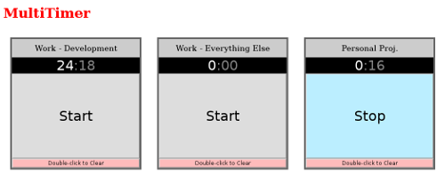

# multitimer
Multiple count-up minute timers in a single HTML document to customize and run!

* Tracks minutes!
* Start and stop the timers!
* Double-click to clear timers, prevents accidents!
* Just copy-paste the HTML timers and customize - have as many as you want!
* Copy the whole document and customize to have whole sets of timers!
* Timers survive refresh using `sessionStorage`!
* It's just HTML and vanilla JS. Read it and see!
